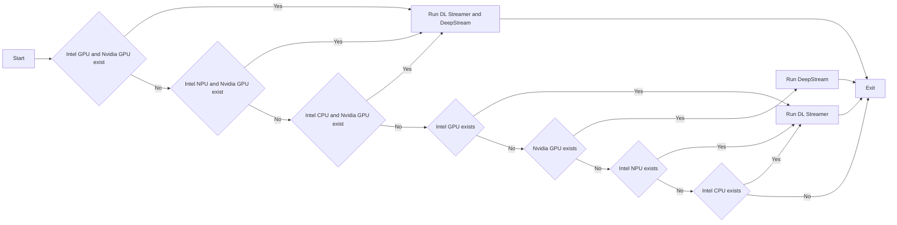

# Coexistently use of DL Streamer and DeepStream

This tutorial explains how to sequentially or simultaneously run DL Streamer and DeepStream on a single machine for optimal performance.
It serves two main purposes:
1. It shows DeepStream users that DL Streamer has similar capabilities and can be used for their use cases with very low time and effort investment.
    - The sample adds DL Streamer to Intel-powered setups without disrupting the current environment configuration.
    - It enables you to run and compare results of typical use cases.
2. It demonstrates how additional machine resources can be utilized. For example, if a user runs detection on an NVIDIA GPU, they can simultaneously execute a DL Streamer pipeline on an Intel integrated GPU, NPU, or CPU. This approach enables more efficient utilization of the system's available compute resources.

## Overview

Systems equipped with both NVIDIA GPUs and Intel hardware (GPU/NPU/CPU) can achieve enhanced performance by distributing workloads across available accelerators. Rather than relying solely on DeepStream for pipeline execution, you can offload additional processing tasks to Intel accelerators, maximizing system resource utilization.

A Python script [coexistence_dls_and_ds.py](https://github.com/open-edge-platform/dlstreamer/blob/main/samples/gstreamer/python/coexistence/coexistence_dls_and_ds.py) is provided to facilitate this coexisting setup. It assumes that Docker and Python are properly installed and configured. Ubuntu 24.04 is currently the only supported operating system.

## Detection algorithm

The DL Streamer pipeline performs license plate detection and subsequently applies OCR to recognize the text. In contrast, the DeepStream pipeline first detects the vehicle, then identifies the license plate within the detected vehicle object, and finally performs OCR to recognize the text.

## Hardware detection

The list of available GPUs is retrieved using the `lspci -nn` Linux utility.
NPU detection is performed by verifying the existence of the `/dev/accel` directory.
CPU information is obtained using the `lscpu` Linux utility.

```python
# Check for Intel and Nvidia hardware
lspci_output=os.popen("lspci -nn").read().split("\n")
video_pattern = re.compile("^.*?(VGA|3D|Display).*$")
INTEL_GPU=False
NVIDIA_GPU=False
INTEL_NPU=False
INTEL_CPU=False
for pci_dev in lspci_output:
    if video_pattern.match(pci_dev) and "Intel" in pci_dev:
        INTEL_GPU=True
    elif video_pattern.match(pci_dev) and "NVIDIA" in pci_dev:
        NVIDIA_GPU=True

if os.path.exists("/dev/accel"):
    INTEL_NPU=True
lscpu_output=os.popen("lscpu").read().replace("\n", " ")
if "Intel" in lscpu_output:
    INTEL_CPU=True
```

## How it works

1. Using the **intel/dlstreamer:2026.0.0-ubuntu24** image.

   The sample downloads `yolov8_license_plate_detector` and `ch_PP-OCRv4_rec_infer`
   models to `./public` directory if they were not downloaded yet.

2. Using the **nvcr.io/nvidia/deepstream:8.0-samples-multiarch** image.

   The sample downloads the `deepstream_tao_apps` repository to the `./deepstream_tao_apps`
   directory. Then, it downloads models for License Plate Recognition (LPR),
   makes a custom library and copies dict.txt to the current directory if `deepstream_tao_apps`
   does not exist.

3. Hardware detection depends on the setup. The algorithm is as follows:

   - Run pipeline sequentially or simultaneously on both devices for:
     - both Nvidia and Intel GPUs
     - if not available then use Nvidia GPU and Intel NPU
     - if not available then use Nvidia GPU with Intel CPU
   - If not available then run pipeline directly per device in the following order:
     - Intel GPU
     - Nvidia GPU
     - Intel NPU
     - Intel CPU



## How to use

Running pipelines sequentially on DL Streamer and DeepStream:

```sh
python3 ./coexistence_dls_and_ds.py <input> LPR <output>
```

Running pipelines simultaneously on DL Streamer and DeepStream:

```sh
python3 ./coexistence_dls_and_ds.py <input> LPR <output> -simultaneously
```

- `input` can be an RTSP or HTTPS stream, or a file.
- License Plate Recognition (LPR) is currently the only supported pipeline.
- `output` is the filename. For example, the `Output.mp4` or `Output` parameters
  will create the `Output_dls.mp4` (DL Streamer output) and/or `Output_ds.mp4`
  (DeepStream output) files.
- Use the `-simultaneously` argument when the user wants to run pipelines concurrently. If the user wants to run pipelines sequentially, no argument is required. 

## Notes

First-time download of the Docker images and models may take a long time.
