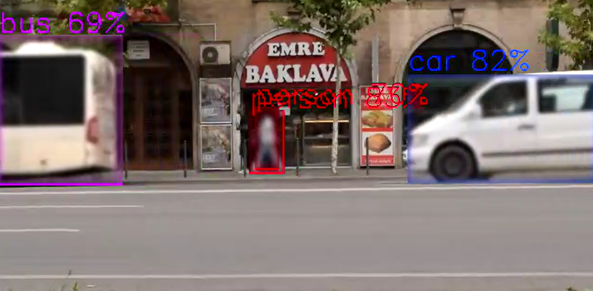
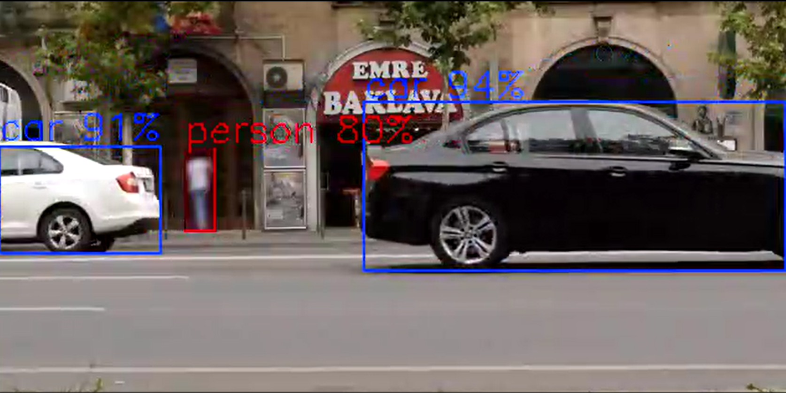
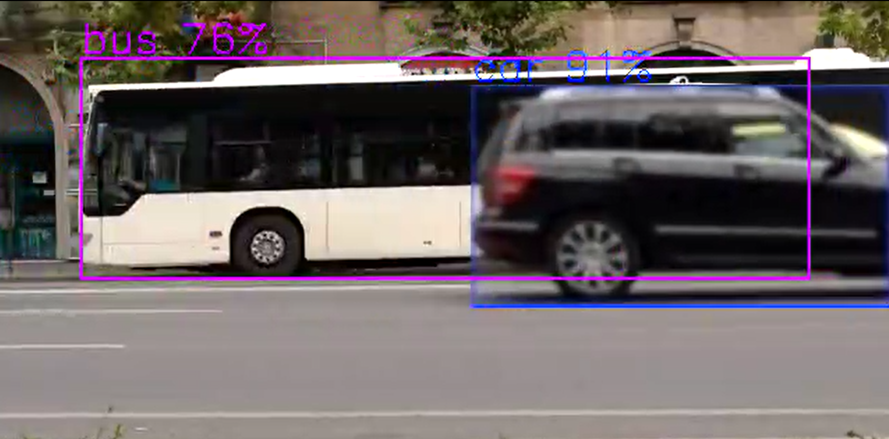

# gvawatermark

Overlays the metadata on the video frame to visualize the inference
results.

```bash
Pad Templates:
  SINK template: 'sink'
    Availability: Always
    Capabilities:
      video/x-raw
                format: { (string)BGRx, (string)BGRA, (string)BGR, (string)NV12, (string)I420 }
                  width: [ 1, 2147483647 ]
                height: [ 1, 2147483647 ]
              framerate: [ 0/1, 2147483647/1 ]
      video/x-raw(memory:DMABuf)
                format: { (string)RGBA, (string)I420 }
                  width: [ 1, 2147483647 ]
                height: [ 1, 2147483647 ]
              framerate: [ 0/1, 2147483647/1 ]
      video/x-raw(memory:VASurface)
                format: { (string)NV12 }
                  width: [ 1, 2147483647 ]
                height: [ 1, 2147483647 ]
              framerate: [ 0/1, 2147483647/1 ]
      video/x-raw(memory:VAMemory)
                format: { (string)NV12 }
                  width: [ 1, 2147483647 ]
                height: [ 1, 2147483647 ]
              framerate: [ 0/1, 2147483647/1 ]

  SRC template: 'src'
    Availability: Always
    Capabilities:
      video/x-raw
                format: { (string)BGRx, (string)BGRA, (string)BGR, (string)NV12, (string)I420 }
                  width: [ 1, 2147483647 ]
                height: [ 1, 2147483647 ]
              framerate: [ 0/1, 2147483647/1 ]
      video/x-raw(memory:DMABuf)
                format: { (string)RGBA, (string)I420 }
                  width: [ 1, 2147483647 ]
                height: [ 1, 2147483647 ]
              framerate: [ 0/1, 2147483647/1 ]
      video/x-raw(memory:VASurface)
                format: { (string)NV12 }
                  width: [ 1, 2147483647 ]
                height: [ 1, 2147483647 ]
              framerate: [ 0/1, 2147483647/1 ]
      video/x-raw(memory:VAMemory)
                format: { (string)NV12 }
                  width: [ 1, 2147483647 ]
                height: [ 1, 2147483647 ]
              framerate: [ 0/1, 2147483647/1 ]

Element has no clocking capabilities.
Element has no URI handling capabilities.

Pads:
  SINK: 'sink'
    Pad Template: 'sink'
  SRC: 'src'
    Pad Template: 'src'

Element Properties:
  async-handling      : The bin will handle Asynchronous state changes
                        flags: readable, writable
                        Boolean. Default: false
  displ-cfg           : Comma separated list of KEY=VALUE parameters of displayed notations.
                        Available options:
                        show-labels=<bool> enable or disable displaying text labels, default true
                        font-scale=<double 0.1 to 2.0> scale factor for text labels, default 0.5
                        thickness=<uint> bounding box thickness, default 2
                        color-idx=<int> color index for bounding box, keypoints, and text, default -1 (use default colors: 0 red, 1 green, 2 blue)
                        draw-txt-bg=<bool> enable or disable displaying text labels background, by enabling it the text color is set to white, default true
                        font-type=<string> font type for text labels, default triplex. Supported fonts: simplex, plain, duplex, complex, triplex, complex_small, script_simplex, script_complex
                        text-x=<float> x position (pixels) for full-frame text (e.g. from gvagenai), default 0
                        text-y=<float> y position (pixels) for full-frame text (e.g. from gvagenai), default 25
                        enable-blur=<bool> enable ROI blurring for privacy protection, default false
                        NOTE : this option is supported only for CPU for now.
                        show-blur-roi=<string> colon-separated list of object labels to blur (e.g., "face:person")
                        hide-blur-roi=<string> colon-separated list of labels to exclude from blurring (show-blur-roi takes precedence)
                        e.g.: displ-cfg=show-labels=false
                        e.g.: displ-cfg=font-scale=0.5,thickness=3,color-idx=2,font-type=plain
                        e.g.: displ-cfg=enable-blur=true,show-blur-roi=face:person
                        e.g.: displ-cfg=text-y=680 (place full-frame text near bottom of a 720p frame)
                        flags: readable, writable
                        String. Default: null
  device              : Supported devices are CPU and GPU. Default is CPU on system memory and GPU on video memory
                        flags: readable, writable
                        String. Default: null
  displ-avgfps        : If true, display the average FPS read from gvafpscounter element on the output video.
                        The gvafpscounter element must be present in the pipeline.
                        e.g. ... ! gvawatermark displ-avgfps=true ! gvafpscounter ! ...
                        flags: readable, writable
                        Boolean. Default: false
  message-forward     : Forwards all children messages
                        flags: readable, writable
                        Boolean. Default: false
  name                : The name of the object
                        flags: readable, writable
                        String. Default: "gvawatermark0"
  parent              : The parent of the object
                        flags: readable, writable
                        Object of type "GstObject"
```

## Visual Examples

The following examples demonstrate how different `displ-cfg` parameters affect the watermark appearance:

### Font Scale

Controls the size of text labels displayed on detected objects.

**Small Font Scale (`font-scale=0.7`)**


**Large Font Scale (`font-scale=2.0`)**  


### Label Display

**Labels Disabled (`show-labels=false`)**


*Shows only bounding boxes without text labels*

### Text Background

**Text Background Enabled (`draw-txt-bg=true`)**


*Blue background makes text more readable over complex backgrounds*

### Color Index

**Red Color (`color-idx=0`)**


*Uses red color for bounding boxes and text*

### Font Types

**Font Comparison**


*Comparison of different font types (simplex vs complex)*

**Default Triplex Font**


*The default triplex font provides good readability*

### Label Filtering

You can selectively show or hide detected objects based on their labels using filtering parameters:

**Include Labels (`show-roi=person:car:truck`)**
- Only objects with labels "person", "car", or "truck" will be displayed
- All other detected objects will be hidden
- Useful for focusing on specific object types

e.g `displ-cfg=show-labels=true,show-roi=car`


**Exclude Labels (`hide-roi=bottle:cup:laptop`)**
- Objects with labels "bottle", "cup", or "laptop" will be hidden
- All other detected objects will be displayed
- Useful for removing distracting or irrelevant objects from the display

e.g `displ-cfg=show-labels=true,hide-roi=car`


**Filter Priority**
- If both `show-roi` and `hide-roi` are specified, `show-roi` takes precedence
- Empty lists mean no filtering is applied

### Blur Feature

The gvawatermark element supports privacy protection through region of interest (ROI) blurring using OpenCV GaussianBlur with a 15x15 kernel. This feature is useful for anonymizing faces, license plates, or other sensitive content in video streams.

#### Blur Configuration Parameters

Blur functionality is controlled through the `displ-cfg` parameter with these options:

- **enable-blur=<bool\>** - Enable or disable blur feature (default: false)
- **show-blur-roi=<string\>** - Colon-separated list of object labels to blur (e.g., "person:face")
- **hide-blur-roi=<string\>** - Colon-separated list of object labels to exclude from blurring

#### Blur Examples

**Basic Blur (All detected objects)**
```bash
# Blur all detected ROIs
displ-cfg=enable-blur=true
```


**Selective Blur (Include specific labels)**
```bash
# Blur only faces and persons
displ-cfg=enable-blur=true,show-blur-roi=face:person
```


```bash
# Blur only cars
displ-cfg=enable-blur=true,show-blur-roi=car
```


**Exclude Blur (Blur all except specific labels)**
```bash
# Blur all objects except cars and trucks
displ-cfg=enable-blur=true,hide-blur-roi=car:truck

# Blur all except persons
displ-cfg=enable-blur=true,hide-blur-roi=person
```

**Combined with Display Options**
```bash
# Blur faces with custom display settings
displ-cfg=enable-blur=true,show-blur-roi=face,show-labels=false,thickness=1

# Blur with labels and colored boxes
displ-cfg=enable-blur=true,show-blur-roi=person:face,color-idx=0,font-scale=0.8
```

#### Filter Precedence Rules

`show-blur-roi` takes precedence over `hide-blur-roi`. When `show-blur-roi` is specified and not empty, only objects matching those labels will be blurred, and `hide-blur-roi` is ignored.

1. **show-blur-roi specified and not empty**: Only labels in show-blur-roi are blurred
2. **show-blur-roi empty or unspecified**: All labels are blurred except those in hide-blur-roi
3. **Neither specified**: All detected ROIs are blurred when enable-blur=true

### Performance consideration

**currently objects blur supported only on CPU**

### Configuration Examples

```bash
# Minimal labels with smaller font
displ-cfg=show-labels=true,show-roi=false

# Large text with background
displ-cfg=font-scale=2.0,draw-txt-bg=true

# Colored thin boxes with simple font  
displ-cfg=color-idx=0,thickness=1,font-type=simplex

# Complete custom styling
displ-cfg=font-scale=1.5,thickness=3,color-idx=2,font-type=complex,draw-txt-bg=true

# Show only specific object types
displ-cfg=show-labels=true,show-roi=person:car:truck

# Hide specific object types
displ-cfg=show-labels=true,hide-roi=bottle:cup:laptop

# Combine filtering with styling
displ-cfg=show-labels=true,show-roi=person:car,font-scale=1.2,color-idx=1

# Move full-frame text (e.g. gvagenai result) to near the bottom of a 720p frame
displ-cfg=text-y=680

# Combine text position with other options
displ-cfg=font-scale=1.5,color-idx=1,thickness=5,text-y=680

# Privacy protection with blur
displ-cfg=enable-blur=true,show-blur-roi=face:person,show-labels=false

# Blur all except specific objects
displ-cfg=enable-blur=true,hide-blur-roi=car:truck,thickness=1
```

### FPS Display

**Average FPS Display (`displ-avgfps=true`)**


*Displays average FPS counter when `gvafpscounter` element is present in pipeline*

