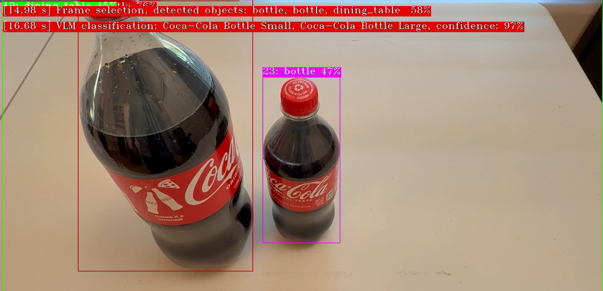
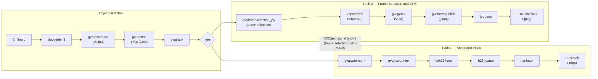

# VLM-assisted Self Checkout

This sample demonstrates a self-checkout pipeline that combines **Computer Vision object detection** with a **Vision-Language Model (VLM)** for intelligent item classification — all inside a single DL Streamer GStreamer pipeline.



The system detects objects on the counter, waits until they are tracked for a configurable duration, selects inventory items matching detected object category, and finally asks the VLM to identify exact inventory items visible. Example VLM prompt (auto-generated from `inventory.txt`):

> *Which of the following items is visible in this image: Coca-Cola Bottle Small, Coca-Cola Bottle Medium, Coca-Cola Bottle Large? Reply only with names of detected items. If no items from the list are visible, reply None.*

Both the object detection model and the VLM run locally on the edge AI device. Note that detailed VLM object classification is accomplished in real time within 1–2 seconds (snapshot taken on an Intel® Core™ Ultra 285H edge device).

## What It Does

1. **Detects** objects in each video frame using a YOLO26s model (`gvadetect`)
2. **Tracks** detected objects across frames (`gvatrack`) and filters by visibility duration
3. **Selects** frames of interest for enhanced VLM classification using a custom Python element (`gvaframeselection_py`, see `plugins/python/gvaFrameSelection.py`)
4. **Classifies** tracked items against a known inventory using a VLM (`gvagenai` with MiniCPM-V 4.5 by default)
5. **Publishes** structured JSONL results and saves snapshot images of classified items
6. **Writes** an annotated output video with watermarked detection and VLM classification results (`gvawatermark`)



The pipeline uses a **tee** to split into two parallel paths:
- **Path 1 (Video):** Watermarks detection/VLM results onto frames and encodes to a video file stored on local disk
- **Path 2 (Analytics):** Runs the custom `gvaframeselection_py` frame-selection element, VLM classification, JSONL publishing, and JPEG snapshot export

A **GObject signal bridge** communicates analytics results from Path 2 back to Path 1 for real-time watermark overlay.


## Prerequisites

- DL Streamer installed on host, or DL Streamer docker image
- Intel EdgeAI System with integrated GPU/NPU (or set `--detect-device CPU --genai-device CPU`)
- Python dependencies installed with:

```bash
python3 -m venv .vlm-self-checkout-venv
source .vlm-self-checkout-venv/bin/activate
curl -LO https://raw.githubusercontent.com/openvinotoolkit/openvino.genai/refs/heads/releases/2026/0/samples/export-requirements.txt
pip install -r export-requirements.txt -r requirements.txt
```

## Model Preparation

### Detection (YOLO26s)

The script automatically downloads `yolo26s.pt` from the Ultralytics hub and converts to OpenVINO IR format under `models/yolo26s_int8_openvino_model/`.
Use `--detect-model-id` to select a different object detection model.

```bash
python3 vlm_self_checkout.py --detect-model-id <yolo_model_id>
```

### VLM (MiniCPM-V-4.5)

The script automatically downloads `openbmb/MiniCPM-V-4_5` from the HuggingFace hub and converts to OpenVINO IR format under `models/MiniCPM-V-4_5/`.
Use `--vlm-model-id` to select a different VLM model from HuggingFace hub.

```bash
python3 vlm_self_checkout.py --vlm-model-id <vlm_model_id>
```

## Running the Sample

Basic usage (downloads a sample video and exports the detection model automatically):

```bash
python3 vlm_self_checkout.py
```

With non-default AI models and user-defined input video file (and inventory):

```bash
python3 vlm_self_checkout.py \
    --video-url https://example.com/checkout.mp4 \
    --inventory-file my-custom-inventory.txt \
    --detect-model-id yolo11s \
    --detect-device NPU \
    --vlm-model-id Qwen/Qwen2-VL-2B-Instruct \
    --genai-device GPU
```

## Custom GStreamer Element: `gvaframeselection_py`

The `plugins/python/gvaFrameSelection.py` file implements a custom `GstBase.BaseTransform` element that provides frame-selection logic:

- **Drops** frames with no detected objects
- **Filters out** excluded object types (configured via `excluded_objects.txt`, e.g., `person`, `dining_table`)
- **Tracks** how long each object has been visible using `GstAnalytics.TrackingMtd`
- **Passes** a frame once an object is tracked for at least `threshold` milliseconds (default: 1500)
- **Dynamically updates** the `gvagenai` prompt with matching inventory items from `inventory.txt`

## Configuration Files

| File | Purpose |
|---|---|
| `config/inventory.txt` | List of known inventory items (one per line). Used to generate targeted VLM prompts. |
| `config/excluded_objects.txt` | Object types to ignore during tracking (e.g., `person`, `dining_table`). |

## Command-Line Arguments

| Argument | Default | Description |
|---|---|---|
| `--video-url` | Pexels sample video | URL to download a video from |
| `--detect-model-id` | `yolo26s` | Ultralytics model id for detection |
| `--detect-device` | `GPU` | Device for YOLO detection inference |
| `--threshold` | `0.4` | Detection confidence threshold (not frame selection threshold) |
| `--inventory-file` | `config/inventory.txt` | Path to inventory items list |
| `--excluded-objects-file` | `config/excluded_objects.txt` | Path to excluded object types list |
| `--vlm-model-id` | `openbmb/MiniCPM-V-4_5` | Hugging Face model ID for VLM (downloaded and exported to OpenVINO) |
| `--genai-device` | `GPU` | Device for VLM inference |
| `--genai-prompt` | Self-checkout item description | Initial prompt for VLM inference |

## Output

Results are written to the `results/` directory:

- `vlm_self_checkout-<video>.mp4` — annotated output video with watermarked detections and VLM results
- `vlm_self_checkout-<video>.jsonl` — structured JSON Lines with VLM classification metadata
- `vlm_self_checkout-<video>-*.jpeg` — snapshot images of frames sent to the VLM
