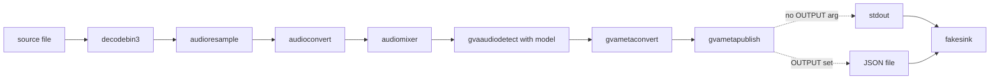

# Audio Detection Sample (Windows)

This sample demonstrates how to construct an audio event detection pipeline using `gst-launch-1.0` command-line utility on Windows.

## How It Works
`gst-launch-1.0` is a command-line utility included with the popular GStreamer media framework. It makes the construction and execution of media pipelines easy based on a simple and intuitive string format. Pipelines are represented as strings containing the names of GStreamer elements separated by exclamation marks `!`. Users can specify properties of an element using `property`=`value` pairs after an element name and before the next exclamation mark.

This sample builds a GStreamer pipeline using the following elements
* `filesrc` or `urisourcebin`
* `decodebin3` for audio decoding
* `audioresample`, `audioconvert` and `audiomixer` for converting and resizing audio input
* [gvaaudiodetect](../../../../../docs/user-guide/elements/gvaaudiodetect.md) for audio event detection using ACLNet
* [gvametaconvert](../../../../../docs/user-guide/elements/gvametaconvert.md) for converting ACLNet detection results into JSON for further processing and display
* [gvametapublish](../../../../../docs/user-guide/elements/gvametapublish.md) for printing detection results to stdout
* `fakesink` for terminating the pipeline

## Pipeline Architecture

This pipeline implements a linear audio analytics flow: it decodes and normalizes raw audio into a standard mono-channel format (16kHz, S16LE) via resamplers and mixers, then utilizes gvaaudiodetect to perform acoustic event recognition. The metadata is finally converted and routed through a conditional publishing stage that either outputs directly to the console or saves to a JSON file.



## Model

This sample uses the ACLNet model trained for audio event detection and made available through the Open Model Zoo. For more details see [here](https://github.com/openvinotoolkit/open_model_zoo/blob/master/models/public/aclnet/aclnet.md).
*   __aclnet_des_53_fp32.onnx__ is end-to-end convolutional neural network architecture for audio classification

> **NOTE**: Before running this sample you'll need to download and prepare the model. Execute `samples\windows\download_omz_models.bat` once to download and prepare models for all audio samples.

## Environment Variables

This sample requires one of the following environment variables to be set:
- `AUDIO_MODELS_PATH`: Path to audio models directory (preferred)
- `MODELS_PATH`: Path to the models directory (fallback if `AUDIO_MODELS_PATH` is not set)

Example:
```PowerShell
$set MODELS_PATH = "C:\models"
```

## Model Proc

Along with the model network and weights, gvaudiodetect uses an additional `model-proc` json file that describes how to prepare the input for the model and interpret its output.

`model-proc` is a JSON file that describes the output layer name and label mapping (Cat, Dog, Baby Crying) for the output of the model. For each possible output of the model (specified using a zero based index) you can set a label and output specific threshold. Check [here](model_proc/aclnet.json).

## Running

```PowerShell
.\audio_event_detection.ps1 [-InputSource <path>] [-OutputFile <file>]
```

### Parameters

| Parameter | Default | Description |
|-----------|---------|-------------|
| -InputSource | how_are_you_doing.wav | Local audio file or URL |
| -OutputFile | (empty) | JSON output file path. If empty, prints to console |

Where `-InputSource` can be:
* local audio file (`C:\path\to\example.audio.wav`)
* network source (ex URL starting with `http://`)

By default, if no `-InputSource` is specified, the sample uses a local file `how_are_you_doing.wav` in the script directory.

> **NOTE**: The default audio file `how_are_you_doing.wav` is located in the Linux samples folder at:
> `samples/gstreamer/gst_launch/audio_detect/how_are_you_doing.wav`
>
> Copy this file to the same directory as the PowerShell script, or provide your own audio file as input.

### Examples
```PowerShell
# Copy the sample audio file first (from repo root)
Copy-Item samples\gstreamer\gst_launch\audio_detect\how_are_you_doing.wav samples\windows\gstreamer\gst_launch\audio_detect\

# Run with default audio file (console output)
.\audio_event_detection.ps1

# Run with custom audio file
.\audio_event_detection.ps1 -InputSource C:\audio\test_audio.wav

# Save output to JSON file
.\audio_event_detection.ps1 -InputSource C:\audio\test_audio.wav -OutputFile detection_results.json
```

## Sample Output

The sample
* prints full gst-launch-1.0 command to the console
* starts the command and outputs audio detection results to the console

## See also
* [Windows Samples overview](../../../README.md)
* [Linux Audio Detection Sample](../../../../gstreamer/gst_launch/audio_detect/README.md)
