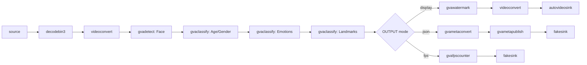

# Face Detection And Classification Sample (Windows)

This sample demonstrates face detection and classification pipeline constructed via `gst-launch-1.0` command-line utility on Windows.

## How It Works
The sample utilizes GStreamer command-line tool `gst-launch-1.0` which can build and run GStreamer pipeline described in a string format.
The string contains a list of GStreamer elements separated by exclamation mark `!`, each element may have properties specified in the format `property`=`value`.

This sample builds GStreamer pipeline of the following elements
* `filesrc` or `urisourcebin` or `ksvideosrc` for input from file/URL/web-camera (Windows uses `ksvideosrc` for webcam access)
* `decodebin3` for video decoding
* `videoconvert` for converting video frame into different color formats
* [gvadetect](https://dlstreamer.github.io/elements/gvadetect.html) for face detection based on OpenVINO™ Toolkit Inference Engine
* [gvaclassify](https://dlstreamer.github.io/elements/gvaclassify.html) inserted into pipeline three times for face classification on three DL models (age-gender, emotion, landmark points)
* [gvawatermark](https://dlstreamer.github.io/elements/gvawatermark.html) for bounding boxes and labels visualization
* `autovideosink` for rendering output video into screen
> **NOTE**: `sync=false` property in `autovideosink` element disables real-time synchronization so pipeline runs as fast as possible


## Pipeline Architecture

This pipeline implements a cascaded inference architecture: a primary `gvadetect` element identifies face regions, which are then processed by three sequential `gvaclassify` elements to extract age/gender, emotions, and facial landmarks. The output branch is selected at start and routes the stream to either a visual display with watermark overlays, a JSON metadata file, or an FPS benchmark sink.



## Models

The sample uses by default the following pre-trained models from OpenVINO™ Toolkit [Open Model Zoo](https://github.com/openvinotoolkit/open_model_zoo)
*   __face-detection-adas-0001__ is primary detection network for finding faces
*   __age-gender-recognition-retail-0013__ age and gender estimation on detected faces
*   __emotions-recognition-retail-0003__ emotion estimation on detected faces
*   __landmarks-regression-retail-0009__ generates facial landmark points

> **NOTE**: Before running samples (including this one), run script `download_omz_models.bat` once (the script located in `samples\windows` folder) to download all models required for this and other samples.

## Environment Variables

This sample requires the following environment variable to be set:
- `MODELS_PATH`: Path to the models directory

Example:
```batch
set MODELS_PATH=C:\models
```

The sample contains `model_proc` subfolder with .json files for each model with description of model input/output formats and post-processing rules for classification models.

## Running

```PowerShell
.\face_detection_and_classification.ps1 [-InputSource <path>] [-Device <device>] [-OutputType <type>] [-JsonFile <file>] [-FrameLimiter <element>]
```

### Parameters

| Parameter | Default | Description |
|-----------|---------|-------------|
| -InputSource | GitHub video URL | Local video file, URL, or USB camera path |
| -Device | CPU | Inference device: CPU, GPU, NPU |
| -OutputType | display | Output type: display, fps, json |
| -JsonFile | output.json | JSON output file name (for json output type) |
| -FrameLimiter | (empty) | Optional GStreamer element to insert after decode (e.g., " ! identity eos-after=1000") |

The input could be:
* local video file (`C:\path\to\video.mp4`)
* web camera device path (Windows USB camera path format like `\\?\usb#...`)
* RTSP camera (URL starting with `rtsp://`) or other streaming source (ex URL starting with `http://`)

If parameter is not specified, the sample by default streams video example from HTTPS link (utilizing `urisourcebin` element) so requires internet connection.

Please refer to OpenVINO™ toolkit documentation for supported devices:
https://docs.openvinotoolkit.org/latest/openvino_docs_IE_DG_supported_plugins_Supported_Devices.html

### Examples
```PowerShell
# Run with default settings (download video from internet, CPU inference, display output)
.\face_detection_and_classification.ps1

# Run with local video file
.\face_detection_and_classification.ps1 -InputSource C:\videos\test.mp4

# Run with GPU inference
.\face_detection_and_classification.ps1 -InputSource C:\videos\test.mp4 -Device GPU

# Run in FPS mode (no display)
.\face_detection_and_classification.ps1 -InputSource C:\videos\test.mp4 -Device CPU -OutputType fps

# Export to JSON
.\face_detection_and_classification.ps1 -InputSource C:\videos\test.mp4 -OutputType json -JsonFile results.json

# Process only first 1000 frames (for testing)
.\face_detection_and_classification.ps1 -InputSource C:\videos\test.mp4 -OutputType json -FrameLimiter " ! identity eos-after=1000"
```

## Sample Output

The sample
* prints gst-launch-1.0 full command line into console
* starts the command and either visualizes video with bounding boxes around detected faces, facial landmarks points and text with classification results (age/gender, emotion) for each detected face or prints out fps if you set SINK_ELEMENT = fps

## See also
* [Windows Samples overview](../../../README.md)
* [Linux Face Detection and Classification Sample](../../../../gstreamer/gst_launch/face_detection_and_classification/README.md)
