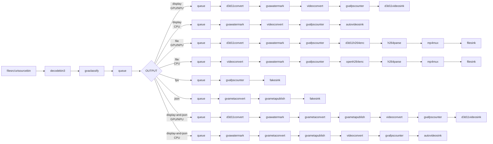

# Human Pose Estimation Sample (Windows)

This sample demonstrates human pose estimation using the `gvaclassify` element with full-frame inference on Windows.

## How It Works

The sample builds a GStreamer pipeline using:
- `filesrc` or `urisourcebin` for input from file/URL
- `decodebin3` for video decoding
- `gvaclassify` with `inference-region=full-frame` for human pose estimation
- `gvawatermark` for visualization of pose keypoints
- `d3d11convert` for D3D11-accelerated video conversion
- `autovideosink` for rendering output video to screen

## Models

The sample uses the following pre-trained model from OpenVINO™ Toolkit [Open Model Zoo](https://github.com/openvinotoolkit/open_model_zoo):
- **human-pose-estimation-0001** - Single person pose estimation network

> **NOTE**: Before running this sample, run `download_omz_models.bat` once (located in `samples\windows` folder) to download all required models.

## Environment Variables

```PowerShell
$set MODELS_PATH = "C:\models"
```

Model should be located at:
- `%MODELS_PATH%\intel\human-pose-estimation-0001\FP32\human-pose-estimation-0001.xml`
## Running

```PowerShell
.\human_pose_estimation.ps1 [-InputSource <path>] [-Device <device>] [-OutputType <type>] [-JsonFile <file>] [-FrameLimiter <element>]
```

Parameters:
- **-InputSource** - Input source (default: `https://github.com/intel-iot-devkit/sample-videos/raw/master/face-demographics-walking.mp4`)
  - Local file path (e.g., `C:\videos\video.mp4`)
  - URL (e.g., `https://...`)
- **-Device** - Device for inference (default: `CPU`)
  - Supported: `CPU`, `GPU`, `NPU`
- **-OutputType** - Output type (default: `display`)
  - `display` - Show video with pose overlay
  - `file` - Save to MP4 file
  - `fps` - Benchmark mode (no display)
  - `json` - Export metadata to JSON
  - `display-and-json` - Show video and save JSON
- **-JsonFile** - JSON output filename (default: `output.json`)
- **-FrameLimiter** - Optional GStreamer element to insert after decode (default: empty)
  - Example: `" ! identity eos-after=1000"` - Process only first 1000 frames
  - Example: `" ! identity eos-after=500"` - Process only first 500 frames
  - Useful for testing/benchmarking with limited frame count

## Examples

### Use default settings (GitHub video, CPU, display)
```PowerShell
.\human_pose_estimation.ps1
```

### Display with CPU inference
```PowerShell
.\human_pose_estimation.ps1 -InputSource "C:\videos\walking.mp4" -Device CPU -OutputType display
```

### Save to file with GPU inference
```PowerShell
.\human_pose_estimation.ps1 -InputSource "C:\videos\walking.mp4" -Device GPU -OutputType file
```

### Export metadata to JSON
```PowerShell
.\human_pose_estimation.ps1 -InputSource "C:\videos\walking.mp4" -Device CPU -OutputType json -JsonFile pose_results.json
```

### Process only first 1000 frames (for testing)
```PowerShell
.\human_pose_estimation.ps1 -InputSource "C:\videos\long_video.mp4" -Device CPU -OutputType json -FrameLimiter " ! identity eos-after=1000"
```

### Benchmark FPS on NPU
```PowerShell
.\human_pose_estimation.ps1 -InputSource "C:\videos\walking.mp4" -Device NPU -OutputType fps
```

## Pipeline Architecture

**Note**: Pipeline varies based on device type. GPU/NPU use D3D11 hardware acceleration (`d3d11convert`, `d3d11videosink`, `d3d11h264enc`), while CPU uses software path (`videoconvert`, `autovideosink`, `openh264enc`).



## Notes

- Windows-specific elements:
  - Uses `d3d11convert` for GPU acceleration (instead of Linux `vapostproc`)
  - Uses `d3d11h264enc` for video encoding (instead of Linux `vah264enc`)
  - Preprocessing backend: `opencv` for CPU, `d3d11` for GPU/NPU
- The `sync=false` property in video sink runs pipeline as fast as possible
- For real-time playback, change to `sync=true`

## See also
* [Windows Samples overview](../../../README.md)
* [Linux Human Pose Estimation Sample](../../../../gstreamer/gst_launch/human_pose_estimation/README.md)
