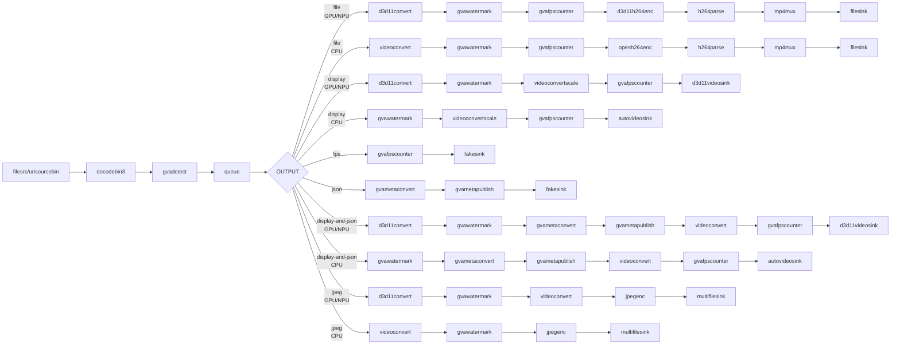

# Instance Segmentation Sample (Windows)

This sample demonstrates instance segmentation using Mask R-CNN models on Windows.

## How It Works

The sample builds a GStreamer pipeline using:
- `filesrc` or `urisourcebin` for input
- `decodebin3` for video decoding
- `gvadetect` for instance segmentation
- `gvawatermark` for mask and bounding box visualization
- `d3d11convert` for D3D11-accelerated processing

## Models

Supports two Mask R-CNN variants from TensorFlow Model Zoo:
- **mask_rcnn_inception_resnet_v2_atrous_coco** - Higher accuracy
- **mask_rcnn_resnet50_atrous_coco** - Faster inference

Both models trained on COCO dataset (80 object classes).

> **NOTE**: Run `download_public_models.bat` before using this sample.

## Environment Variables

```PowerShell
$set MODELS_PATH = "C:\models"
```

Models should be located at:
- `%MODELS_PATH%\public\mask_rcnn_inception_resnet_v2_atrous_coco\FP16\mask_rcnn_inception_resnet_v2_atrous_coco.xml`
- `%MODELS_PATH%\public\mask_rcnn_resnet50_atrous_coco\FP16\mask_rcnn_resnet50_atrous_coco.xml`

## Running

```PowerShell
.\instance_segmentation.ps1 [-Model <model>] [-Device <device>] [-InputSource <path>] [-OutputType <type>] [-JsonFile <file>] [-FrameLimiter <element>]
```

Parameters:
- **-Model** - Model name (default: `mask_rcnn_inception_resnet_v2_atrous_coco`)
  - Supported: `mask_rcnn_inception_resnet_v2_atrous_coco`, `mask_rcnn_resnet50_atrous_coco`
- **-Device** - Inference device (default: `CPU`)
  - Supported: `CPU`, `GPU`, `NPU`
- **-InputSource** - Input source (default: `https://videos.pexels.com/video-files/1192116/1192116-sd_640_360_30fps.mp4`)
  - Local file path (e.g., `C:\videos\street.mp4`)
  - URL (e.g., `https://...`)
- **-OutputType** - Output type (default: `file`)
  - `file` - Save to MP4 with watermark
  - `display` - Display video with overlay
  - `fps` - Benchmark mode (no display)
  - `json` - Export metadata to JSON
  - `display-and-json` - Display and export
  - `jpeg` - Save frames as JPEG sequence
- **-JsonFile** - JSON output filename (default: `output.json`)
- **-FrameLimiter** - Optional GStreamer element to insert after decode (default: empty)
  - Example: `" ! identity eos-after=100"` - Process only first 100 frames
  - Example: `" ! identity eos-after=1000"` - Process only first 1000 frames
  - Useful for testing/benchmarking with limited frame count

## Examples

### Use default settings (Inception ResNet V2, CPU, Pexels video, save to file)
```PowerShell
.\instance_segmentation.ps1
```

### ResNet50 on GPU with display
```PowerShell
.\instance_segmentation.ps1 -Model mask_rcnn_resnet50_atrous_coco -Device GPU -InputSource "C:\videos\street.mp4" -OutputType display
```

### Export to JSON
```PowerShell
.\instance_segmentation.ps1 -Model mask_rcnn_inception_resnet_v2_atrous_coco -Device CPU -InputSource "C:\videos\street.mp4" -OutputType json -JsonFile segmentation.json
```

### Export segmentation masks as JPEG sequence
```PowerShell
.\instance_segmentation.ps1 -Model mask_rcnn_resnet50_atrous_coco -Device GPU -InputSource "C:\videos\street.mp4" -OutputType jpeg
```

### Benchmark FPS on NPU
```PowerShell
.\instance_segmentation.ps1 -Model mask_rcnn_resnet50_atrous_coco -Device NPU -InputSource "C:\videos\street.mp4" -OutputType fps
```

### Process only first 100 frames (for testing)
```PowerShell
.\instance_segmentation.ps1 -Model mask_rcnn_inception_resnet_v2_atrous_coco -Device CPU -InputSource "C:\videos\street.mp4" -OutputType json -FrameLimiter " ! identity eos-after=100"
```

## Output

The model outputs:
- **Bounding boxes** - Object locations
- **Class labels** - Object categories (person, car, etc.)
- **Instance masks** - Pixel-level segmentation masks
- **Confidence scores** - Detection confidence

COCO classes include: person, bicycle, car, motorcycle, airplane, bus, train, truck, boat, traffic light, fire hydrant, stop sign, parking meter, bench, bird, cat, dog, horse, sheep, cow, elephant, bear, zebra, giraffe, backpack, umbrella, handbag, tie, suitcase, frisbee, skis, snowboard, sports ball, kite, baseball bat, baseball glove, skateboard, surfboard, tennis racket, bottle, wine glass, cup, fork, knife, spoon, bowl, banana, apple, sandwich, orange, broccoli, carrot, hot dog, pizza, donut, cake, chair, couch, potted plant, bed, dining table, toilet, TV, laptop, mouse, remote, keyboard, cell phone, microwave, oven, toaster, sink, refrigerator, book, clock, vase, scissors, teddy bear, hair drier, toothbrush.

## Pipeline Architecture

**Note**: Pipeline varies based on device type. GPU/NPU use D3D11 hardware acceleration (`d3d11convert`, `d3d11videosink`, `d3d11h264enc`), while CPU uses software path (`videoconvert`, `autovideosink`, `openh264enc`).



## Performance Tips

1. **Use ResNet50 model** for faster inference
2. **GPU device** provides best performance
3. **Lower input resolution** reduces processing time
4. **Preprocessing backend**: Use `d3d11` for GPU, `opencv` for CPU

## See also
* [Windows Samples overview](../../../README.md)
* [Linux Instance Segmentation Sample](../../../../gstreamer/gst_launch/instance_segmentation/README.md)
