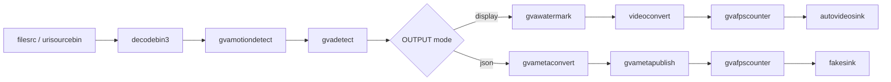

# Motion Detect Sample (gst-launch command line)

This README documents the Windows `motion_detect.ps1` script, a simple way to run the `gvamotiondetect` element in a GStreamer pipeline, additionally chaining `gvadetect` over motion ROIs.

## How It Works

The script builds and runs a GStreamer pipeline with `gst-launch-1.0`. It supports CPU inference and accepts a local file or URI source.

Key elements in the pipeline:
- `urisourcebin` or `filesrc` + `decodebin3`: input and decoding
- `gvamotiondetect`: motion region detection (ROI publisher)
- `gvadetect`: runs object detection restricted to motion ROIs (`inference-region=1`)
- Output:
  - `gvametaconvert` + `gvametapublish`: write metadata to `output.json` (JSON Lines)
  - or `autovideosink`: on-screen rendering with FPS counter

## Pipeline Architecture

This pipeline demonstrates DL Streamer motion detection workflow: gvamotiondetect acts as a spatial-temporal filter to identify movement, triggering gvadetect (YOLOv8n) only when necessary to optimize compute resources.



## Models

The sample uses YOLOv8n (resolved via `MODELS_PATH`) or other supported object detection model with the OpenVINO™ format.

## Usage

```PowerShell
.\motion_detect.ps1 [-Device <device>] [-InputSource <path>] [-Model <model>] [-Precision <precision>] [-PreprocessBackend <backend>] [-OutputType <type>] [-MotionDetectOptions <options>] [-FrameLimiter <element>]
```

### Parameters

| Parameter | Default | Description |
|-----------|---------|-------------|
| -Device | CPU | Currently only supports CPU |
| -InputSource | DEFAULT | Local file path or URI. Use 'DEFAULT' for built-in sample video |
| -Model | (auto) | Optional OpenVINO XML model path. Leave empty to use yolov8n from MODELS_PATH |
| -Precision | FP32 | Model precision: FP32, FP16, INT8 |
| -PreprocessBackend | opencv | Pre-process backend for gvadetect |
| -OutputType | display | Output type: display, json |
| -MotionDetectOptions | (empty) | Extra properties for gvamotiondetect (e.g., "threshold=0.5") |
| -FrameLimiter | (empty) | Optional GStreamer element to insert after decode (e.g., " ! identity eos-after=1000") |

Notes:
- The script defaults to `yolov8n` model and converts paths to forward slashes for GStreamer.

## Examples

- CPU path with default source and model:
```PowerShell
$env:MODELS_PATH = "C:\models"
.\motion_detect.ps1 -Device CPU -InputSource DEFAULT -Precision FP32 -PreprocessBackend opencv -OutputType display
```
- CPU path with local file, display output, and custom motion detector options:
```PowerShell
$env:MODELS_PATH = "C:\models"
.\motion_detect.ps1 -Device CPU -InputSource C:\path\to\video.mp4 -Precision FP32 -PreprocessBackend opencv -OutputType display -MotionDetectOptions "motion-threshold=0.07 min-persistence=2"
```
- Explicit model path:
```PowerShell
.\motion_detect.ps1 -Device CPU -InputSource C:\path\to\video.mp4 -Model C:\path\to\models\yolov8n.xml -Precision FP32 -PreprocessBackend opencv -OutputType json
```
- Process only first 1000 frames (for testing):
```PowerShell
.\motion_detect.ps1 -Device CPU -InputSource C:\path\to\video.mp4 -OutputType json -FrameLimiter " ! identity eos-after=1000"
```

## Motion Detector Options

`-MotionDetectOptions` lets you pass properties directly to the `gvamotiondetect` element. Provide them as a space-separated list in quotes:

```PowerShell
.\motion_detect.ps1 -MotionDetectOptions "motion-threshold=0.07 min-persistence=2"
```

- `motion-threshold`: Float in [0..1]. Sensitivity of motion detection; lower values detect smaller changes, higher values reduce false positives. Example: `0.05` (more sensitive) vs `0.10` (less sensitive).
- `min-persistence`: Integer ≥ 0. Minimum number of consecutive frames a region must persist to be reported as motion. Helps filter out transient noise.
- Other properties: You can pass any supported `gvamotiondetect` property the element exposes (e.g., ROI size or smoothing controls, if available in your build). Use `gst-inspect-1.0 gvamotiondetect` to list all properties and defaults.

Tip: Start with `motion-threshold=0.07` and `min-persistence=2`, then adjust based on scene noise and desired sensitivity.

## Output

- JSON mode: writes metadata to `output.json` (JSON Lines) and prints FPS via `gvafpscounter`.
- Display mode: renders via `autovideosink`.
