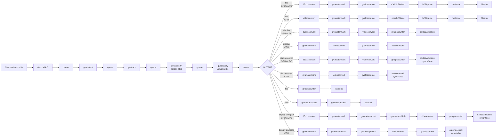

# Vehicle and Pedestrian Tracking Sample (Windows)

This sample demonstrates object detection, tracking, and classification pipeline on Windows using DL Streamer.

## How It Works

The sample builds a GStreamer pipeline using:
- `filesrc` or `urisourcebin` for input
- `decodebin3` for video decoding
- `gvadetect` for object detection (person, vehicle, bike)
- `gvatrack` for object tracking across frames
- `gvaclassify` (2x) for person and vehicle attribute classification
- `gvawatermark` for visualization
- `d3d11convert` for D3D11-accelerated video processing

## Models

The sample uses the following pre-trained models from OpenVINO™ Toolkit [Open Model Zoo](https://github.com/openvinotoolkit/open_model_zoo):
- **person-vehicle-bike-detection-2004** - Object detection
- **person-attributes-recognition-crossroad-0230** - Person attributes (is_male, has_bag, has_hat, etc.)
- **vehicle-attributes-recognition-barrier-0039** - Vehicle attributes (color, type)

> **NOTE**: Run `download_omz_models.bat` once before using this sample.

## Environment Variables

```PowerShell
$set MODELS_PATH = 'C:\models'
```

Models should be located at:
- `%MODELS_PATH%\intel\person-vehicle-bike-detection-2004\FP32\person-vehicle-bike-detection-2004.xml`
- `%MODELS_PATH%\intel\person-attributes-recognition-crossroad-0230\FP32\person-attributes-recognition-crossroad-0230.xml`
- `%MODELS_PATH%\intel\vehicle-attributes-recognition-barrier-0039\FP32\vehicle-attributes-recognition-barrier-0039.xml`

## Running

```PowerShell
.\vehicle_pedestrian_tracking.ps1 [-InputSource <path>] [-DetectionInterval <interval>] [-Device <device>] [-OutputType <type>] [-TrackingType <type>] [-JsonFile <file>] [-FrameLimiter <element>]
```

Parameters:
- **-InputSource** - Input source (default: `https://github.com/intel-iot-devkit/sample-videos/raw/master/person-bicycle-car-detection.mp4`)
  - Local file path (e.g., `C:\videos\traffic.mp4`)
  - URL (e.g., `https://...`)
- **-DetectionInterval** - Detection frequency (default: `3`)
  - `1` = detect every frame (highest accuracy, slowest)
  - `3` = detect every 3rd frame (tracking fills gaps)
  - Higher value = better performance, lower accuracy
- **-Device** - Inference device (default: `AUTO`)
  - Supported: `AUTO`, `CPU`, `GPU`, `GPU.0`, `NPU`
- **-OutputType** - Output type (default: `display`)
  - `display` - Display with sync
  - `display-async` - Display async (faster)
  - `fps` - Benchmark mode (no display)
  - `json` - Export metadata to JSON
  - `display-and-json` - Display and export
  - `file` - Save to MP4 file
- **-TrackingType** - Tracking algorithm (default: `short-term-imageless`)
  - `short-term-imageless` - Fast, appearance-free tracking
  - `zero-term` - Detection-only (no tracking)
  - `zero-term-imageless` - Simplified zero-term
- **-JsonFile** - JSON output filename (default: `output.json`)
- **-FrameLimiter** - Optional GStreamer element to insert after decode (default: empty)
  - Example: `" ! identity eos-after=1000"` - Process only first 1000 frames
  - Useful for testing/benchmarking with limited frame count

## Examples

### Use default settings (GitHub video, detect every 3rd frame, AUTO device, display)
```PowerShell
.\vehicle_pedestrian_tracking.ps1
```

### Detect every 3rd frame with tracking on GPU
```PowerShell
.\vehicle_pedestrian_tracking.ps1 -InputSource "C:\videos\traffic.mp4" -DetectionInterval 3 -Device GPU -OutputType display-async
```

### High-accuracy mode (detect every frame)
```PowerShell
.\vehicle_pedestrian_tracking.ps1 -InputSource "C:\videos\traffic.mp4" -DetectionInterval 1 -Device AUTO -OutputType display
```

### Export tracking data to JSON
```PowerShell
.\vehicle_pedestrian_tracking.ps1 -InputSource "C:\videos\traffic.mp4" -DetectionInterval 3 -Device GPU -OutputType json -TrackingType short-term-imageless -JsonFile tracking_results.json
```

### Performance benchmark (detect every 10 frames)
```PowerShell
.\vehicle_pedestrian_tracking.ps1 -InputSource "C:\videos\traffic.mp4" -DetectionInterval 10 -Device GPU -OutputType fps
```

### Different tracking algorithm
```PowerShell
.\vehicle_pedestrian_tracking.ps1 -InputSource "C:\videos\traffic.mp4" -DetectionInterval 1 -Device GPU -OutputType display -TrackingType zero-term
```

### Process only first 1000 frames (for testing)
```PowerShell
.\vehicle_pedestrian_tracking.ps1 -InputSource "C:\videos\traffic.mp4" -DetectionInterval 10 -Device GPU -OutputType json -FrameLimiter " ! identity eos-after=1000"
```

## Pipeline Architecture

**Note**: Pipeline varies based on device type. GPU/AUTO use D3D11 hardware acceleration (`d3d11convert`, `d3d11videosink`, `d3d11h264enc`), while CPU uses software path (`videoconvert`, `autovideosink`, `openh264enc`).



## See also
* [Windows Samples overview](../../../README.md)
* [Linux Vehicle and Pedestrian Tracking Sample](../../../../gstreamer/gst_launch/vehicle_pedestrian_tracking/README.md)
